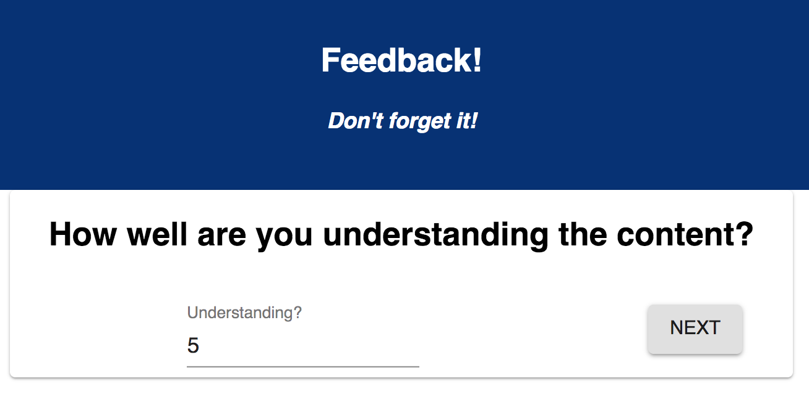
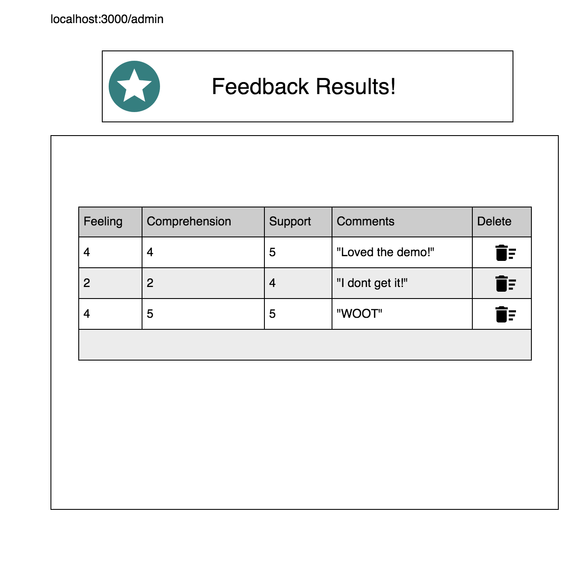

# Redux Feedback Loop

## Description

 For this assignment, I created a feedback form modeled after Prime's system. Feedback will be collected over 4 views. A separate review page displays the current feedback values and a submit button. On submit, data is sent to a SQL database

 ## Technology Used
 - React
 - Redux
 - Axios
 - SQL
 
### SETUP

Create your database and tables using the provided `data.sql` file. Start the server.

```
npm install
npm run server
```

Now that the server is running, open a new terminal tab with `cmd + t` and start the react client app.

```
npm run client
```

### ADD NEW FEEDBACK

> NOTE: As a baseline requirement, you must use Redux to store your data across views.

Create a multi-part form that allows users to leave feedback for today. 
There will be 4 views for the form parts.

The parts:
- How are you feeling today?

- How well are you understanding the content?

- How well are you being supported?

- Any comments you want to leave?


While there is no nav bar, each part of the form should be at its own route. Clicking next should move the user to the appropriate step in the process.

### Input Validation

Each step should only allow the user to advance to the next step if a score was provided. Be sure to tell the user in some way that a value must be provided.

The `Comments` step does not need to be validated, an empty value is okay.

## THE REVIEW COMPONENT

The last step of the process will allow the user to review their feedback. Users are not able to change their input on this step or go back for Base Mode. 


## SUBMIT THE FEEDBACK

The `Review` step needs to have a submit button which will be clicked on to actually submit the completed feedback to the server.

When the submit button is clicked, save the submission in the database. The user should see a submission success page. They can then click the button to take a new survey, which needs to reset all the data and go back to the first step.


## STRETCH GOALS

> NOTE: These stretch goals are intended to be completed in order.

### UPDATE FEEDBACK

Allow the user to go back to a previous step and change their feedback. You still need to disallow empty values!

<!-- ### STYLING
Improve the styling of the app using Material-UI. This might inclued cards, snackbars, buttons, a nav bar, icons, and/or a theme.  -->

### ADMIN SECTION

- Display all of the existing feedback at the route `/admin`. The most recently added feedback should appear at the top of the list. Allow the user to delete existing feedback. Prompt the user to confirm prior to deleting the feedback from the database.


